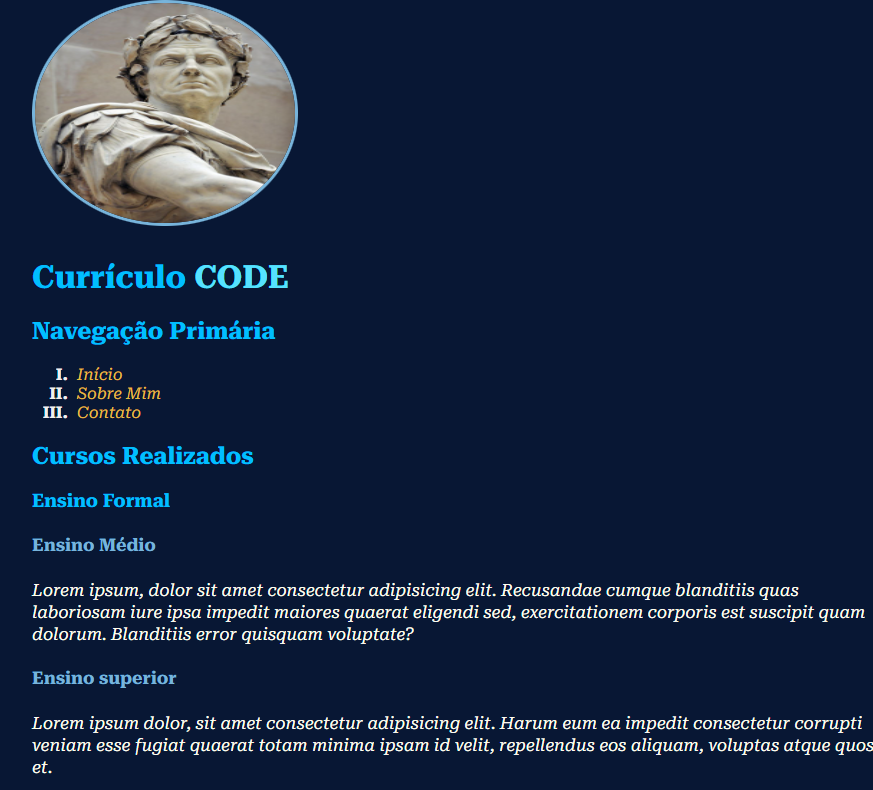

<h1 align = "center">   Currículo Code </h1> 

# 
<h2 align="center">
Projeto construído em conjunto da ProWay, consiste um currículo com 3 páginas.
</h2>

## ✔️ Tecnologias utilizadas 
> HTML 

> CSS 

> Git & Github
